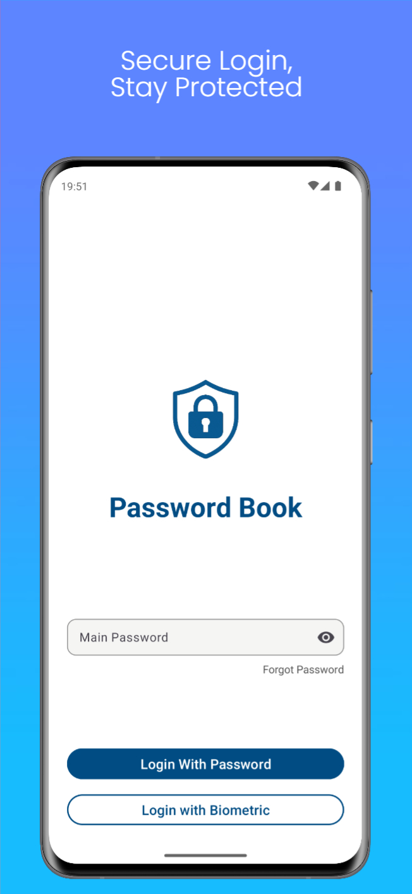
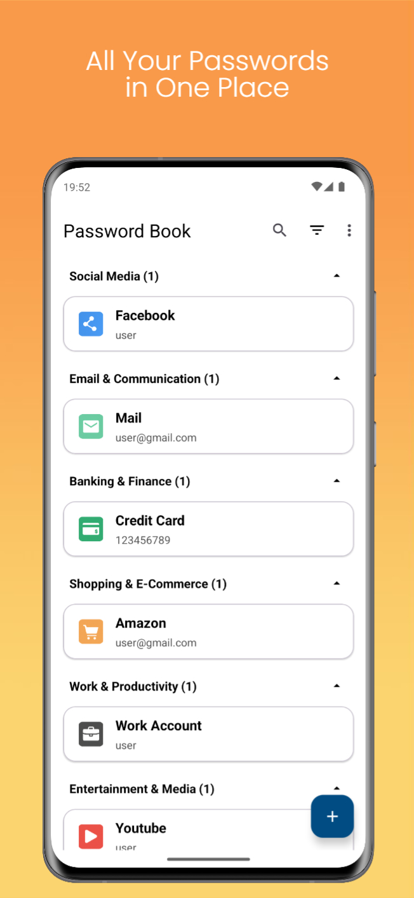
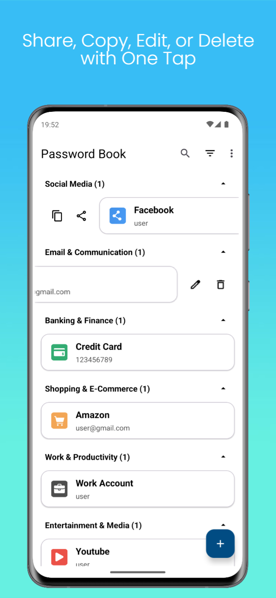
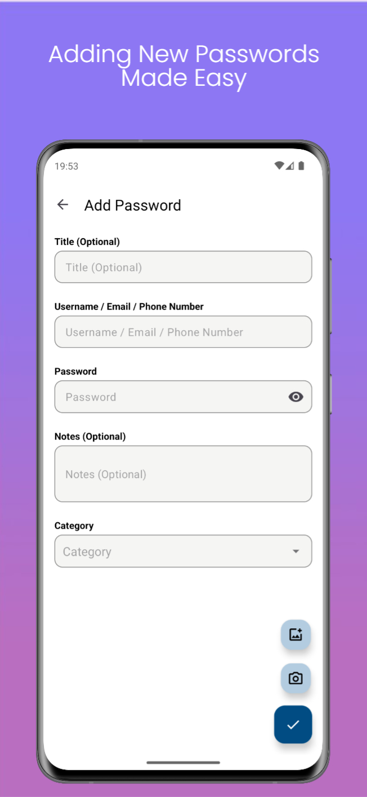
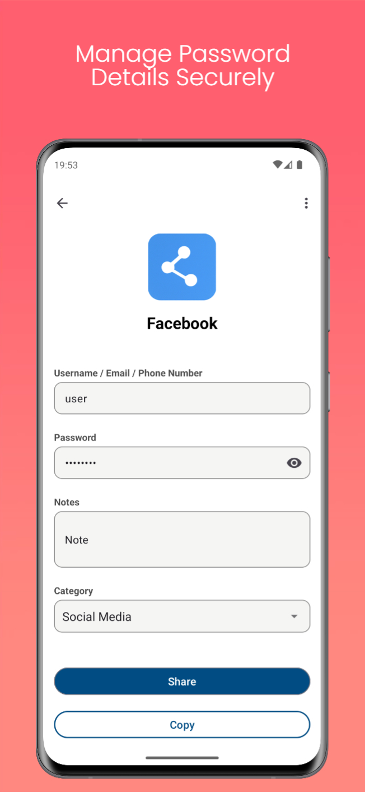
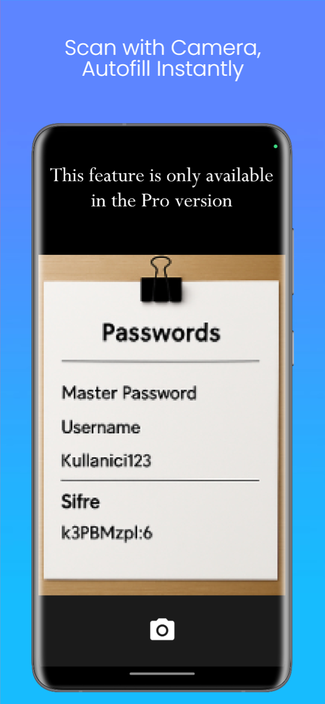
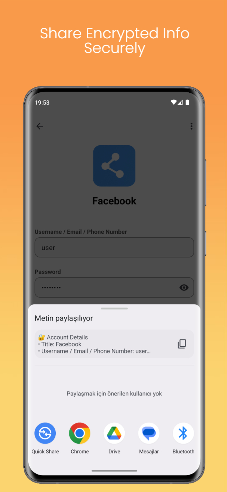
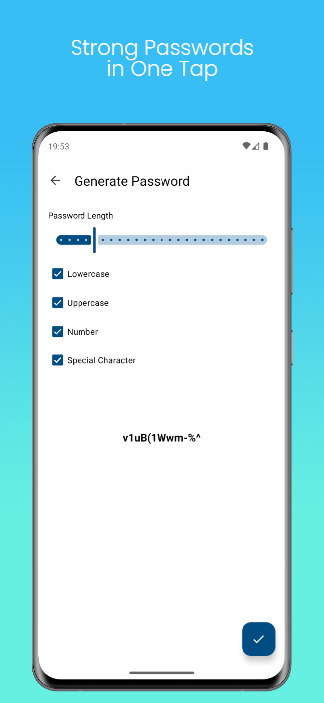
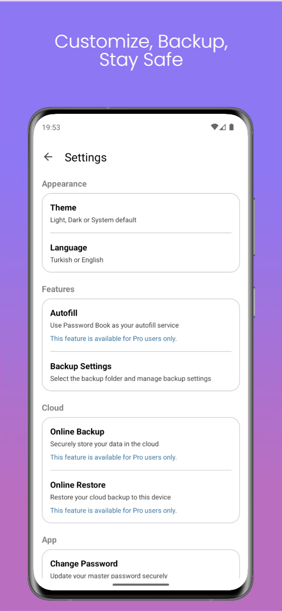
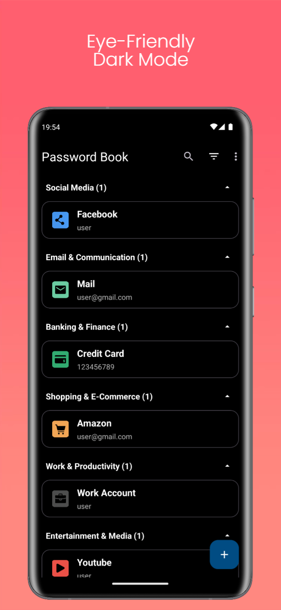

  

<h1 align="center">🔐 Password Book – Offline & Secure Password Manager</h1>

  <b>Minimal · Offline · AES-256 Encrypted</b> 
  Store your passwords securely with a modern Material You interface.

---

## ✨ Highlights

**PasswordBook** is a fully offline and ad-free password manager that focuses on **privacy-first storage**.  
All data is encrypted with **AES-256 + Android Keystore**, ensuring your information never leaves your device.

---

## 🔐 Core Security

- AES-256 encrypted local storage
- Master password + biometric login
- Secure clipboard (auto-clears in 300 seconds)
- Export/Import **encrypted backups**
- Root detection & enhanced protection

> **No network permission required.**  
> Zero tracking – zero data collection.

---

## 🚀 Productivity Features

- Password generator (customizable rules)
- **AutoFill service** for other apps
- **OCR**: Fill passwords by scanning printed text
- **Voice input**: Save passwords by speaking
- **Encrypted sharing**
    - QR secure sharing
    - Styled image share
- Optional **automatic secure backups**

---

## 🎨 UI & Accessibility

- Modern Material You design
- Light / Dark / System themes
- Categorized & searchable storage
- Multi-language support:
    - English 🇬🇧
    - Turkish 🇹🇷

---

## 🛠 Tech Stack

| Layer           | Technology                               |
|-----------------|--------------------------------------------|
| UI              | Jetpack Compose, Material 3                |
| DB & Encryption | Room + AES-256 + Keystore                  |
| Security        | BiometricPrompt, Root detection            |
| Features        | OCR, AutoFill, Voice Input, Secure Sharing |
| Reporting       | Firebase Analytics & Crashlytics           |
| Language        | Kotlin, Compose-first architecture         |

---

## 📸 Screenshots

### 🔐 Secure Login
| Secure Login |
|--------------|
|  |

---

### 📂 All Passwords in One Place
| All Passwords in One Place | Share, Copy, Edit, or Delete |
|----------------------------|------------------------------|
|  |  |

---

### ➕ Add & Manage Passwords
| Add New Password | Manage Password Details |
|------------------|-------------------------|
|  |  |

---

### 🤖 Smart Pro Features
| Scan with Camera (OCR & Autofill) | Share Encrypted Info Securely |
|-----------------------------------|--------------------------------|
|  | ) |

---

### 🔑 Strong Generator & Flexible Settings
| Password Generator | Customize, Backup, Stay Safe |
|--------------------|------------------------------|
|  |  |

---

### 🌙 Dark Mode
| Eye-Friendly Dark Mode |
|------------------------|
|  |

---

## 🧩 Architecture Overview

PasswordBook is built with a **Compose + MVVM** architecture.

| Directory Name | Layer Responsibility | Key Components |
| :--- | :--- | :--- |
| `core/` | Core Infrastructure | Essential non-UI components like **Encryption**, **Keystore** management, and general **Security** modules. |
| `data/` | Data Layer | Manages all persistence and data handling. Includes **Room DB**, **DAO**, **Backup** logic, and **Repository** implementations. |
| `domain/` | Domain Layer | Contains the central business logic. Defines **Use Cases** and core **Models**. |
| `ui/` | Presentation Layer | Houses all user-facing components, including **Compose Screens** and their corresponding **ViewModels**. |
| `features/` | Feature Modules | Specific, complex feature implementations such as **OCR**, **AutoFill**, **Backup**, **Sharing**, and **Voice** capabilities. |

---

## 🔒 Privacy Policy

> PasswordBook stores all data **locally and encrypted** on your device.  
> No data leaves your device — ever.

✔ No accounts  
✔ No ads  
✔ No tracking  
✔ No cloud storage (optional encrypted cloud backup only)

---

## 🛣️ Roadmap

- 🟦 Multi-device sync via end-to-end encryption
- 🟦 Browser extension integration
- 🟦 Custom categories & icons

---

## 📩 Contact

Developed by **Mahmut Alperen Ünal**

- 🔗 GitHub: [github.com/mahmutaunal](https://github.com/mahmutaunal)  
- 📧 Email: [mahmutalperenunal@gmail.com](mailto:mahmutalperenunal@gmail.com)

---

### 📌 Note
This repository showcases the product only.  
The source code of PasswordBook is **private**.
