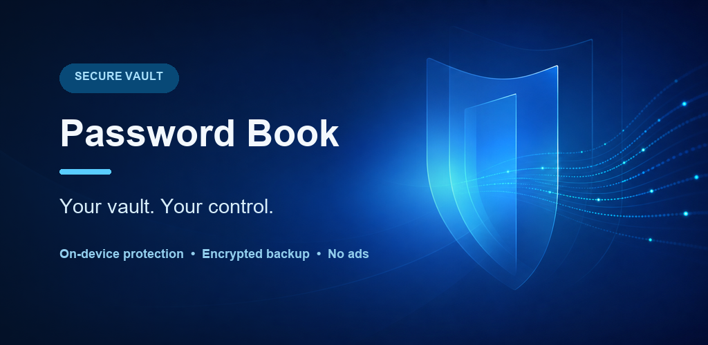
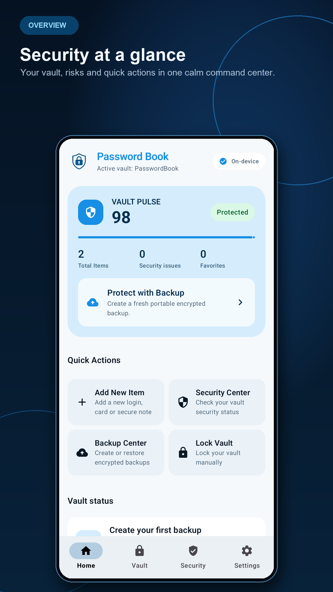
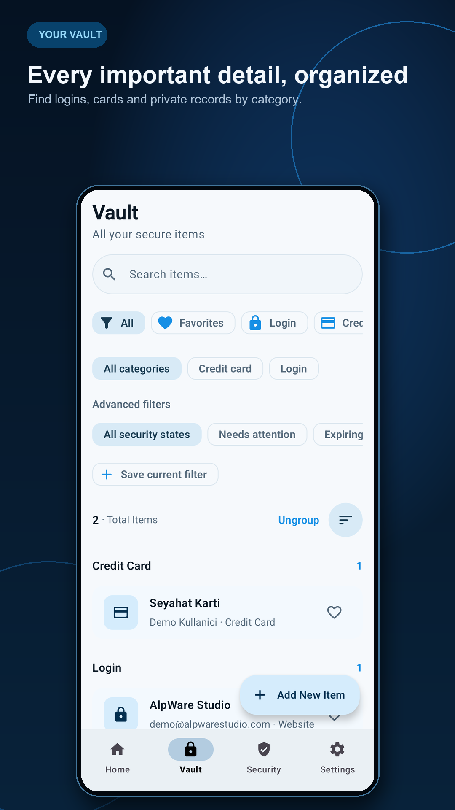
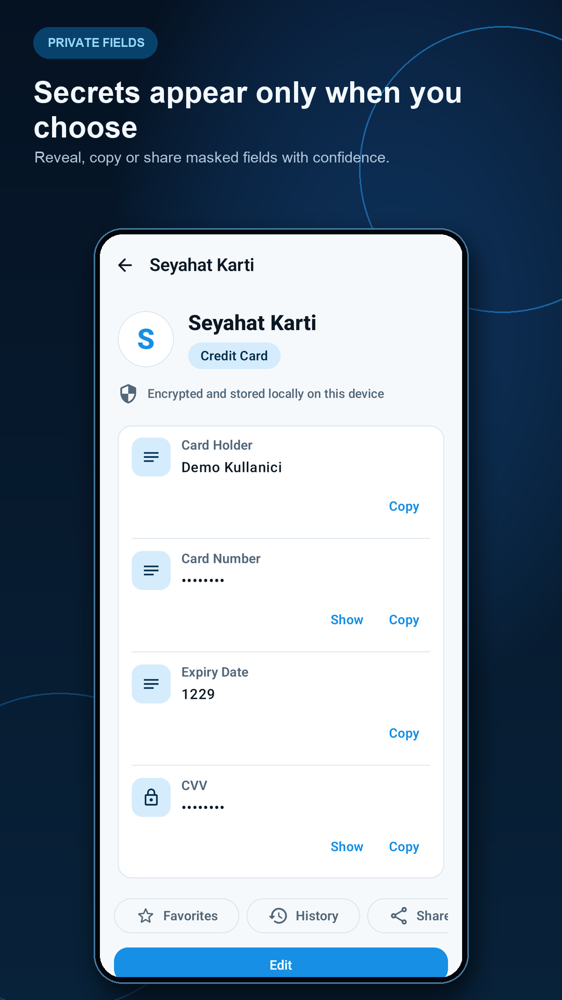
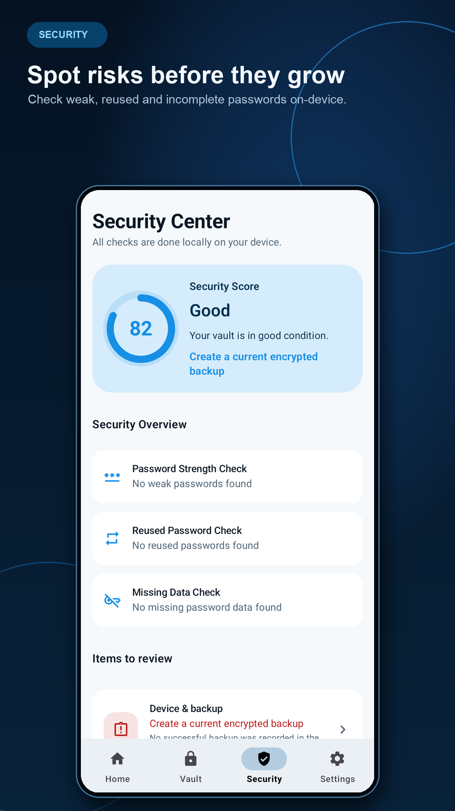
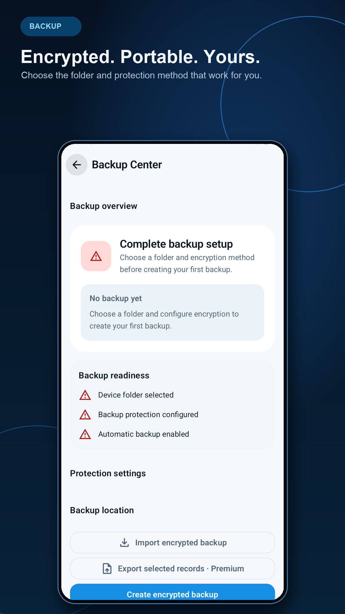
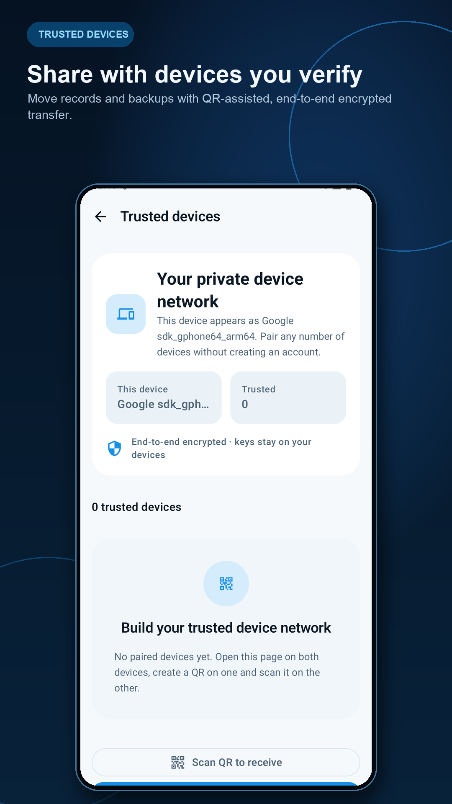
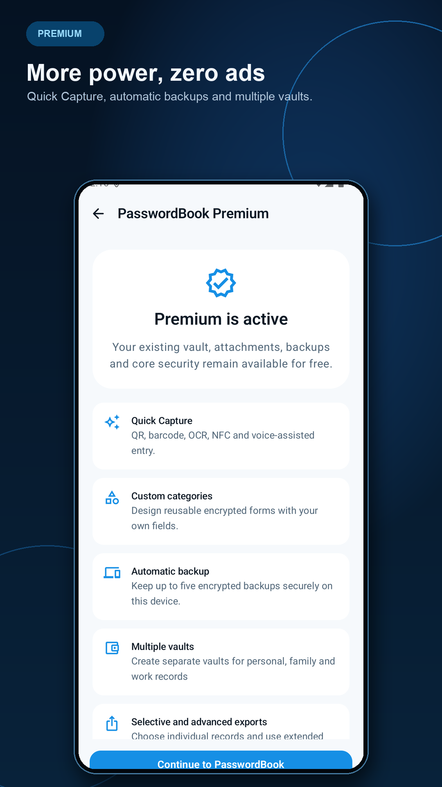

  

<h1 align="center">Password Book</h1>

  <strong>Your private, encrypted vault for passwords and important records.</strong>

  Local-first security &nbsp;•&nbsp; Modern Android experience &nbsp;•&nbsp; No advertising

  

  

## One secure place for what matters

Password Book is a privacy-focused Android vault by **AlpWare Studio**. It helps you organize passwords, payment cards, identity details, secure notes, Wi-Fi credentials, license keys and encrypted attachments without turning daily security into a complicated workflow. Account-free device sync keeps the user—not a Password Book server—in control of where encrypted vault data moves.

Your vault is designed around local protection, understandable recovery choices and clear user control. Essential record management remains free, while Premium adds advanced capture, automation, organization and synchronization tools. The app contains no banner, interstitial or rewarded advertising—and no advertising SDK.

## Designed for clarity. Built for control.

| Stay organized | Understand your security | Keep your data portable |
| --- | --- | --- |
| Categories, recognizable subcategory icons, tags, favorites, filters and grouped views keep every record easy to find. | Security Center checks password strength, reuse and missing information locally on the device. | Encrypted backups, verified-device sync and optional user-controlled WebDAV keep portability understandable. |

### Everyday essentials

- Flexible templates for logins, cards, identities, secure notes, Wi-Fi and license keys
- Fast search, saved filters, favorites, tags and category-based grouping
- Masked sensitive fields with deliberate reveal and copy actions
- Encrypted attachments with compact previews and integrity validation
- Dashboard summaries for vault health, backups, trusted devices and multiple vaults
- Dedicated Sync Center for direct sync, conflicts, history and optional personal cloud
- Trash, restore and permanent deletion controls
- Light, dark and system themes with responsive phone and tablet layouts
- English and Turkish localization
- Optional access recovery through biometrics, a recovery kit or an authorized trusted device

## Product showcase

<table>
  <tr>
    <td width="33%"></td>
    <td width="33%"></td>
    <td width="33%"></td>
  </tr>
  <tr>
    <td width="33%"></td>
    <td width="33%"></td>
    <td width="33%"></td>
  </tr>
  <tr>
    <td width="33%"></td>
    <td width="33%"></td>
    <td width="33%"></td>
  </tr>
</table>

## Privacy and security by design

Password Book is engineered to reduce unnecessary exposure of sensitive data:

- AES-GCM authenticated encryption protects sensitive vault values
- Master Keys are processed with PBKDF2-HMAC-SHA-256 and per-user cryptographic material
- Android Keystore protects device-bound secrets and biometric unlock material
- Configurable auto-lock and re-authentication protect returning sessions
- Sensitive clipboard contents and temporary files are cleared automatically
- Screen protection can block screenshots and recent-app previews
- Private Android application data is excluded from platform backup
- Cleartext network traffic is disabled
- Production integrity checks use Firebase App Check with Play Integrity

Vault contents, attachments, Master Keys and backup passwords are not intentionally sent to Firebase. Network-enabled platform services are limited to capabilities such as Google Play Billing, updates, reviews, integrity checks and diagnostics disclosed in the [Privacy Policy](../docs/index.html).

Optional Premium personal-cloud sync connects directly to an HTTPS WebDAV provider selected by the user. Password Book uploads only per-vault authenticated encrypted objects. WebDAV credentials are protected locally with Android Keystore and are never sent to AlpWare Studio.

> No security product can guarantee protection on every compromised device. Keep Android and Google Play services updated, use a strong Master Key and protect exported backup files.

## Encrypted backup and migration

- Save manual encrypted backups directly to a folder you choose
- Use a dedicated backup password or a verified Master Key
- Restore through a guided, verifiable import flow
- Run supported backup and restore operations in the background with progress notifications
- Enable Premium daily, weekly, monthly or after-change automatic backups
- Upgrade from supported legacy Password Book versions through verified, resumable migration

### A careful path from Password Book v1

Supported v1 installations are upgraded locally through a resumable migration that verifies available records and attachments before retiring the legacy source. Existing password-based migration remains the primary path. Eligible users who explicitly enabled biometric access in v1 can use a strong Android biometric check to create a new Master Key through a short-lived, one-time local recovery authorization. Vault content and biometric templates are not sent to AlpWare Studio during this process.

After a successful upgrade, Password Book introduces the refreshed experience, offers biometric unlock and startup-screen choices, and explains the optional Recovery Center so returning users can configure the protection that fits them.

## Free and Premium

| Free foundation | Premium tools |
| --- | --- |
| Essential encrypted vault and record management | Custom categories and dynamic encrypted fields |
| Search, filters, favorites, tags and grouped views | Multiple isolated vaults |
| Attachments, Trash and manual encrypted backup | Automatic and after-change backups |
| Security basics and product education | Advanced Security Center actions and duplicate analysis |
| One verified companion for manual sync, sharing and configured recovery | Camera/gallery OCR, QR/barcode, NFC and voice-assisted capture |
| Light, dark and system themes | Advanced Android Autofill and selective exports |
| No advertising | Unlimited verified devices and automatic local-network sync |
| | Personal-cloud sync through user-controlled HTTPS WebDAV |

Premium entitlement is delivered through Google Play Billing. Core access to existing vault records, attachments, backups and essential security remains available without advertising.

## Built for modern Android

Password Book uses a Compose-first Kotlin architecture with Material 3, ViewModel, Coroutines, Flow and Room. Platform integrations include Android Keystore, BiometricPrompt, Autofill, WorkManager, CameraX, ML Kit, Nearby Connections, DNS-SD local sync, HTTPS WebDAV and Google Play services.

- Minimum supported version: Android 9
- Responsive layouts: phones and tablets
- Languages: English and Turkish
- Distribution: Google Play

## Get Password Book

Download the current release from [Google Play](https://play.google.com/store/apps/details?id=com.mahmutalperenunal.passwordsbook) and create a private vault that stays understandable as it grows.

## AlpWare Studio

Password Book is designed and developed by **AlpWare Studio**.

- [Official website](https://www.alpwarestudio.com)
- [More AlpWare Studio apps](https://play.google.com/store/apps/dev?id=5245599652065968716)
- [Privacy Policy](../docs/index.html)
- [Support](mailto:mahmutalperenunal@gmail.com)

  <strong>Password Book</strong> 
  Your vault. Your control.

